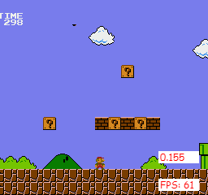
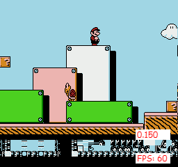
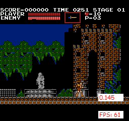
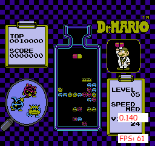
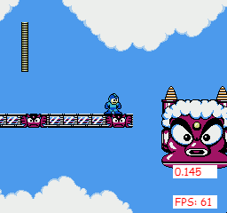
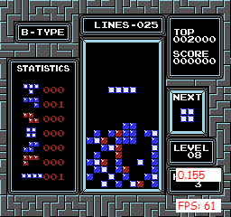
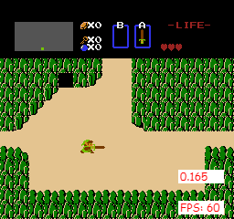
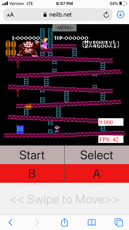

# NES HTML
This is an NES Emulator written in TypeScript. It was a really fun project for me because it was my first emulator and it was based around a console I grew up with and loved. From a technical perspective it definitely helped me understand how computers work on a low level. The emulator itself is far from perfect though most of the popular games are at least playable, but with some graphical glitches. The main reason for this is how I implemented the rendering system of the PPU by making it tile based rather than scanline based. I initially did it out of expediency however some day I hope to update it with a proper renderer. Because of this, things like menus and status bars will always scroll with the screen. The sound is mostly implemented however the noise channel is in a broken state so I disabled it for now. Several mappers are implemented as well.

Building this emulator was mainly a learning experience for me and perhaps someone out there can get some use out of it. Being in TypeScript it helps with browsing through the code which is well commented. The emulator also comes with a few interesting features that I implemented - things like Xbox Controller Support, Mobile Support, Save States, and a pretty good debugger. It also comes with a test rom which is a little "game" I wrote in 6502 assembly (source included)

You can give it a try here - 

https://www.neilb.net/nes_html/

# Notable Features
- Savestates
- Gamepad support
- Mobile support with touch controls
- 2 player controller support
- ability to remap keys
- built in debugger
- limited sound support
  - square and triangle channels implemented
  - broken noise channel and DMC
- Playable Games
  - Super Mario 1, 2, 3
  - Megaman 2, 3
  - Zelda 1, 2
  - Tetris
  - Donkey Kong
  - Double Dragon
  - Dr Mario
  - Excite Bike
  - Castlevania 1, 2
  - Metroid
- Mapper Support
  - NROM
  - MMC1
  - MMC3 (Limited, broken scanline counter and IRQ)
  - UxROM
  - AxROM
  - CNROM
  
# Build
- You will need TypeScript to build the JavaScript Files
- If you don't have TypeScript installed on your machine run
  - `npm install -g typescript`
- then cd into the src directory
- and run `tsc` to run the TypeScript compiler
- Then just open the site up in a web server
  - If you're using VS Code I recommend using the Live Server extension
  
# Screenshots
  
| Game | Screenshot |
| --- | ----------- |
| Mario 1 |  |
| Mario 3 |  |
| Castlevania |  |
| Dr Mario |  |
| Megaman 2 |  |
| Tetris |  |
| Zelda |  |
| Donkey Kong on Mobile |  |

